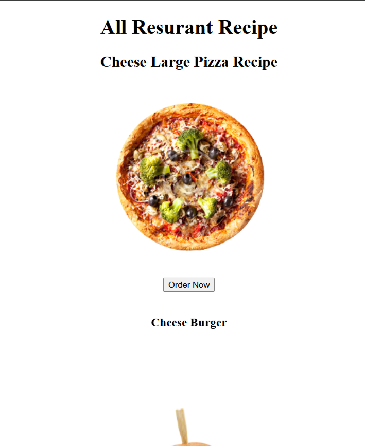

# 🍽️ Recipe Page Using HTML

> A clean, responsive, and well-structured recipe page built using only HTML5.

---

## 📸 Project Preview

<p align="center">
  
</p>

---

## 🚀 Live Demo

🔗 **Live Website:**  
https://joni250.github.io/recipe-page-html/

---

## 📂 Repository

🔗 **GitHub Repository:**  
https://github.com/Joni250/recipe-page-html

---

## ✨ Features

- ✅ Clean and responsive layout
- ✅ Semantic HTML5 structure
- ✅ Well-organized recipe sections
- ✅ Ingredients list
- ✅ Step-by-step cooking instructions
- ✅ Beginner-friendly project
- ✅ Simple and user-friendly interface

---

## 🛠️ Technologies Used

| Technology | Purpose |
|------------|---------|
| HTML5 | Page structure and recipe layout |

---

## 📁 Project Structure

```text
recipe-page-html/
│── index.html
│── preview.png
│── README.md
```

---

## 🎯 Project Purpose

This project was created to practice semantic HTML by building a structured recipe page. It focuses on organizing content such as ingredients, cooking instructions, headings, and lists in a clean and readable format.

---

## 💡 What I Learned

- HTML5 Structure
- Semantic HTML Elements
- Ordered & Unordered Lists
- Headings & Paragraphs
- Content Organization
- Clean Code Structure

---

## 👩‍💻 Author

** Mst Joni Khatun**

Aspiring Frontend & WordPress Developer

GitHub:  
https://github.com/Joni250

---

## ⭐ Support

If you found this project helpful, please consider giving it a ⭐ on GitHub.
